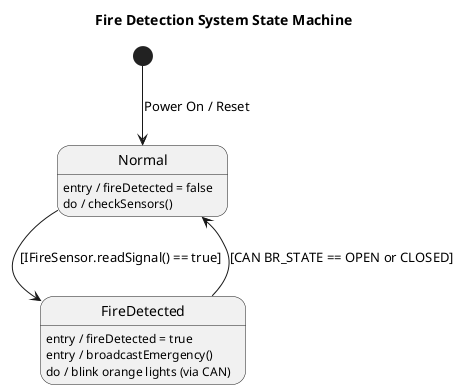

# Fire Detection System State Machine

```plantuml
@startuml FireDetectionSystem_States
title Fire Detection System State Machine

[*] --> Normal : Power On / Reset

state Normal {
  Normal : entry / fireDetected = false
  Normal : do / checkSensors()
}

state FireDetected {
  FireDetected : entry / fireDetected = true
  FireDetected : entry / broadcastEmergency()
  FireDetected : do / blink orange lights (via CAN)
}

Normal --> FireDetected : [IFireSensor.readSignal() == true]
FireDetected --> Normal : [CAN BR_STATE == OPEN or CLOSED]

@enduml
```
