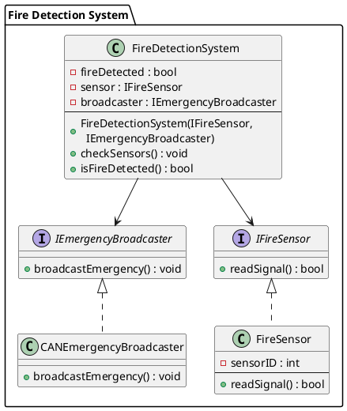

# Fire Detection System UML Diagram

```plantuml
@startuml Parkify_FireSystem
' ─────────────────────────────────────────
package "Fire Detection System" {
    interface IFireSensor {
        + readSignal() : bool
    }

    interface IEmergencyBroadcaster {
        + broadcastEmergency() : void
    }

    class FireSensor {
        - sensorID : int
        --
        + readSignal() : bool
    }

    class CANEmergencyBroadcaster {
        + broadcastEmergency() : void
    }

    class FireDetectionSystem {
        - fireDetected : bool
        - sensor : IFireSensor
        - broadcaster : IEmergencyBroadcaster
        --
        + FireDetectionSystem(IFireSensor,\n  IEmergencyBroadcaster)
        + checkSensors() : void
        + isFireDetected() : bool
    }

    FireDetectionSystem -down-> IFireSensor
    FireDetectionSystem -down-> IEmergencyBroadcaster

    FireSensor              .up.|> IFireSensor
    CANEmergencyBroadcaster .up.|> IEmergencyBroadcaster
}
@enduml
```
