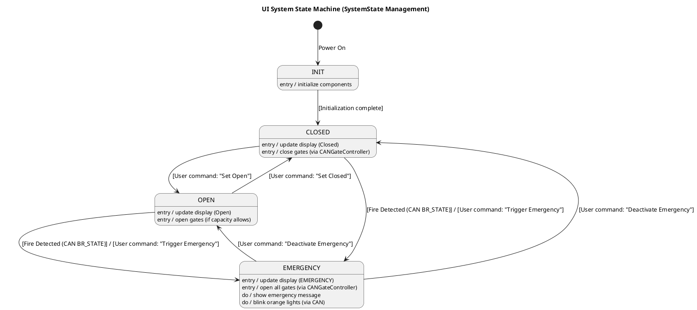

# UI Node State Machine

```plantuml
@startuml UI_SystemState_Transitions
title UI System State Machine (SystemState Management)

[*] --> INIT : Power On

state INIT {
  INIT : entry / initialize components
}

state CLOSED {
  CLOSED : entry / update display (Closed)
  CLOSED : entry / close gates (via CANGateController)
}

state OPEN {
  OPEN : entry / update display (Open)
  OPEN : entry / open gates (if capacity allows)
}

state EMERGENCY {
  EMERGENCY : entry / update display (EMERGENCY)
  EMERGENCY : entry / open all gates (via CANGateController)
  EMERGENCY : do / show emergency message
  EMERGENCY : do / blink orange lights (via CAN)
}

INIT --> CLOSED : [Initialization complete]

CLOSED --> OPEN : [User command: "Set Open"]
OPEN --> CLOSED : [User command: "Set Closed"]

CLOSED --> EMERGENCY : [Fire Detected (CAN BR_STATE)] / [User command: "Trigger Emergency"]
OPEN --> EMERGENCY : [Fire Detected (CAN BR_STATE)] / [User command: "Trigger Emergency"]

EMERGENCY --> CLOSED : [User command: "Deactivate Emergency"]
EMERGENCY --> OPEN : [User command: "Deactivate Emergency"]

@enduml
```
