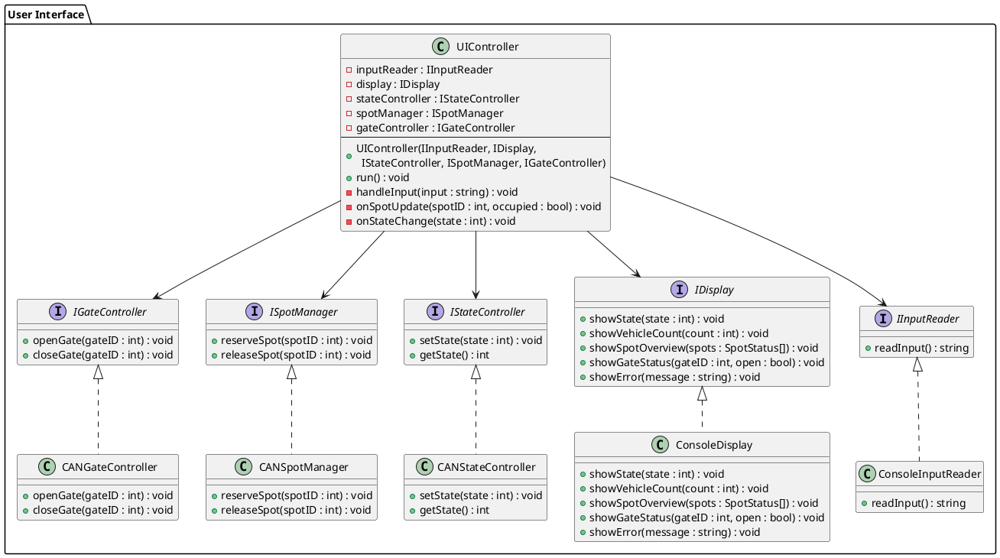

# UI Node UML Diagram

```plantuml
@startuml Parkify_UI_FireSystem
' ─────────────────────────────────────────
package "User Interface" {
    interface IInputReader {
        + readInput() : string
    }

    interface IDisplay {
        + showState(state : int) : void
        + showVehicleCount(count : int) : void
        + showSpotOverview(spots : SpotStatus[]) : void
        + showGateStatus(gateID : int, open : bool) : void
        + showError(message : string) : void
    }

    interface IStateController {
        + setState(state : int) : void
        + getState() : int
    }

    interface ISpotManager {
        + reserveSpot(spotID : int) : void
        + releaseSpot(spotID : int) : void
    }

    interface IGateController {
        + openGate(gateID : int) : void
        + closeGate(gateID : int) : void
    }

    class ConsoleInputReader {
        + readInput() : string
    }

    class ConsoleDisplay {
        + showState(state : int) : void
        + showVehicleCount(count : int) : void
        + showSpotOverview(spots : SpotStatus[]) : void
        + showGateStatus(gateID : int, open : bool) : void
        + showError(message : string) : void
    }

    class CANStateController {
        + setState(state : int) : void
        + getState() : int
    }

    class CANSpotManager {
        + reserveSpot(spotID : int) : void
        + releaseSpot(spotID : int) : void
    }

    class CANGateController {
        + openGate(gateID : int) : void
        + closeGate(gateID : int) : void
    }

    class UIController {
        - inputReader : IInputReader
        - display : IDisplay
        - stateController : IStateController
        - spotManager : ISpotManager
        - gateController : IGateController
        --
        + UIController(IInputReader, IDisplay,\n  IStateController, ISpotManager, IGateController)
        + run() : void
        - handleInput(input : string) : void
        - onSpotUpdate(spotID : int, occupied : bool) : void
        - onStateChange(state : int) : void
    }

    UIController -down-> IDisplay
    UIController -down-> IInputReader
    UIController -down-> IStateController
    UIController -down-> ISpotManager
    UIController -down-> IGateController

    ConsoleInputReader   .up.|> IInputReader
    ConsoleDisplay       .up.|> IDisplay
    CANStateController   .up.|> IStateController
    CANSpotManager       .up.|> ISpotManager
    CANGateController    .up.|> IGateController
}

@enduml
```
